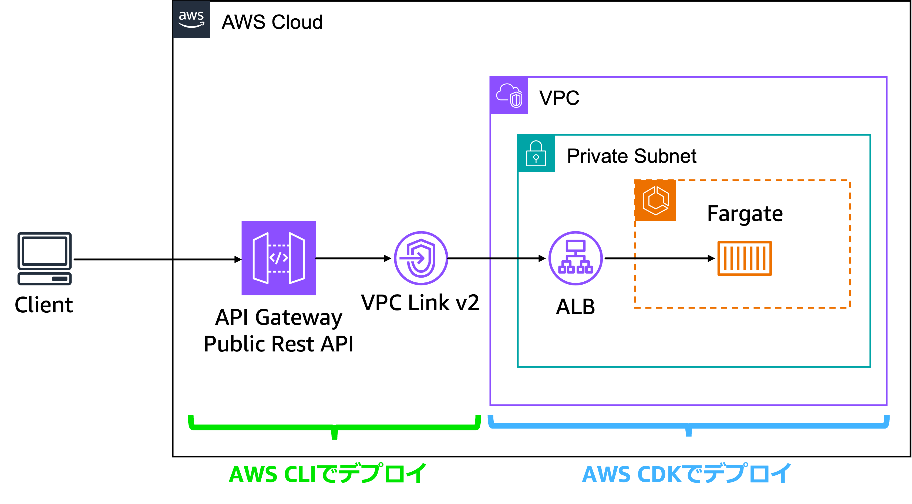

# API Gateway + ALB Private Integration + Response Streaming サンプル

このリポジトリは、2025年11月に発表されたAWS API Gatewayの2つのアップデートを検証するために作ったサンプルスクリプトです。

## 目的

このサンプルは、以下の2つの新機能を実際に動作させることを目的としています。

1. **API Gateway Private Integration with ALB** (2025年11月)
   - API GatewayからApplication Load Balancer (ALB)へのプライベート統合
   - VPC Link v2を使用した完全プライベートネットワーク構成
   - 参考: [Build scalable REST APIs using Amazon API Gateway private integration with Application Load Balancer](https://aws.amazon.com/jp/blogs/compute/build-scalable-rest-apis-using-amazon-api-gateway-private-integration-with-application-load-balancer/)

2. **API Gateway Response Streaming** (2025年11月)
   - ストリーミングレスポンスのサポート
   - リアルタイムデータ配信やAI生成コンテンツに最適
   - 参考: [Building responsive APIs with Amazon API Gateway response streaming](https://aws.amazon.com/jp/blogs/compute/building-responsive-apis-with-amazon-api-gateway-response-streaming/)

このサンプルでは、Amazon Bedrock (Claude Haiku)を使用したストリーミングチャットAPIを、完全プライベートなネットワーク構成で実装しています。

## アーキテクチャ



### 主要コンポーネント

- **API Gateway REST API**: パブリックエンドポイント、ストリームモード有効
- **VPC Link v2**: API GatewayとALBを接続
- **Application Load Balancer**: プライベートサブネット内に配置
- **ECS Fargate**: FastAPIアプリケーションをホスト
- **Amazon Bedrock**: Claude Haikuモデルでストリーミングレスポンス生成
- **VPC Endpoints**: NAT Gatewayなしでのプライベート通信

### ネットワーク構成の特徴

- ECS FargateとALBはPrivate Isolated Subnetに配置

## デプロイされるエンドポイント

- `/health`: ヘルスチェックエンドポイント
- `/stream`: Bedrockを使用したストリーミングチャットAPI
  - リアルタイムで Bedrock Claude Haiku の応答をストリーミング
  - SSE (Server-Sent Events) 形式でデータを返却

## 前提条件

### 必要なツール

- Node.js 18.x以上
- AWS CLI v2
- AWS CDK v2
- Docker
- jq (API Gatewayセットアップスクリプト用)

### AWS設定

- AWS認証情報が設定済みであること
- Amazon Bedrock Claude Haikuモデルへのアクセス権限
  - モデルID: `global.anthropic.claude-haiku-4-5-20251001-v1:0`
  - us-east-1リージョンでモデルアクセスを有効化

## セットアップ手順

### 1. 依存関係のインストール

```bash
npm i
```

### 2. CDKスタックのデプロイ

```bash
# CDKのブートストラップ（初回のみ）
npx cdk bootstrap

# スタックのデプロイ
npx cdk deploy
```

デプロイには5〜10分程度かかります。以下のリソースが作成されます。
- VPC (Private Subnetのみ)
- VPC Endpoints (ECR, S3, CloudWatch Logs, Bedrock Runtime)
- ECS Cluster & Fargate Service
- Application Load Balancer (Private)
- Security Groups

### 3. API Gatewayの設定

CDKデプロイ完了後、以下のスクリプトを実行してAPI Gatewayを設定します。

```bash
chmod +x scripts/setup-api-gateway.sh
./scripts/setup-api-gateway.sh
```

このスクリプトは以下を自動的に実行します：
- VPC Link v2の作成
- REST APIの作成
- ALBへのプライベート統合設定
- ストリームモードの有効化
- デプロイメントの作成

## 使用方法

### APIエンドポイントの確認

セットアップスクリプト実行後、以下の形式でエンドポイントが表示されます：

```
https://{api-id}.execute-api.us-east-1.amazonaws.com/test
```

### ヘルスチェック

```bash
curl https://{api-id}.execute-api.us-east-1.amazonaws.com/test/health
```

レスポンス例：
```json
{"status":"healthy"}
```

### ストリーミングAPIの呼び出し

```bash
curl -X POST https://{api-id}.execute-api.us-east-1.amazonaws.com/test/stream \
  -H "Content-Type: application/json" \
  -d '{"message": "こんにちは"}' \
  --no-buffer
```

レスポンス例（ストリーミング）：
```
data: こんにちは

data: ！

data: 何

data: か

data: お

data: 手伝い

...
```

## プロジェクト構成

```
.
├── bin/
│   └── apigw-alb-stream.ts          # CDKアプリケーションのエントリーポイント
├── lib/
│   ├── apigw-alb-stream-stack.ts    # メインスタック定義
│   └── constructs/
│       └── ecs-app-construct.ts     # ECS/ALB構成のコンストラクト
├── app/
│   ├── app.py                       # FastAPIアプリケーション
│   ├── Dockerfile                   # コンテナイメージ定義
│   └── requirements.txt             # Python依存関係
├── scripts/
│   └── setup-api-gateway.sh         # API Gateway設定スクリプト
├── cdk.json                         # CDK設定
└── package.json                     # Node.js依存関係
```

### 主要ファイル

- **lib/apigw-alb-stream-stack.ts**: VPC、VPC Endpoints、ECS、ALBを定義
- **lib/constructs/ecs-app-construct.ts**: ECS FargateとALBの構成を定義
- **app/app.py**: Bedrock APIを呼び出すFastAPIアプリケーション
- **scripts/setup-api-gateway.sh**: API Gateway、VPC Link、統合設定を自動化

## 技術スタック

### インフラストラクチャ

- **AWS CDK**: TypeScript

### アプリケーション

- **言語**: Python 3.12
- **フレームワーク**: FastAPI
- **AWS SDK**: boto3

### AWSサービス

- Amazon API Gateway (REST API)
- Amazon VPC (VPC Link v2)
- Elastic Load Balancing (Application Load Balancer)
- Amazon ECS (Fargate)
- Amazon ECR
- Amazon Bedrock
- Amazon CloudWatch Logs


## クリーンアップ

### 1. API Gatewayリソースの削除

```bash
# REST APIの削除
aws apigateway delete-rest-api --rest-api-id {api-id}

# VPC Linkの削除
aws apigatewayv2 delete-vpc-link --vpc-link-id {vpc-link-id}
```

### 2. CDKスタックの削除

```bash
npx cdk destroy
```

確認プロンプトで`y`を入力してください。

## 参考リンク

- [Build scalable REST APIs using Amazon API Gateway private integration with Application Load Balancer](https://aws.amazon.com/jp/blogs/compute/build-scalable-rest-apis-using-amazon-api-gateway-private-integration-with-application-load-balancer/)
- [Building responsive APIs with Amazon API Gateway response streaming](https://aws.amazon.com/jp/blogs/compute/building-responsive-apis-with-amazon-api-gateway-response-streaming/)
